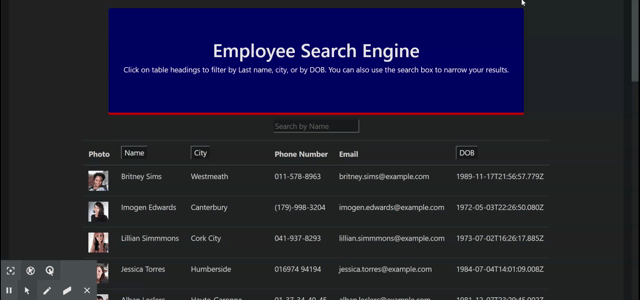

# Employee Search App

## User Story
As a user, I want to be able to view my entire employee directory at once so that I have quick access to their information.

[Link to Deployed app](https://wyliedavid1984.github.io/employeeSearch/)

## Description 

Project 19 tasked the student with building out an employee tracker using React as the main library with the functionality to search for employees by name as well as order the list by one data type. As this assignment was given with very vague instructions. You are able to search by name. You can also sort out the columns by clicking on the heading. The Name, City, and DOB all with sort first by ascending and then descending.

### Table Of Contents

-[Description](#Description)

-[Technologies](#Technologies)
   
-[Usages](#Usages)

-[Visuals](#Visuals)

-[Credits](#Credits)

-[License](#License) 

## Technologies

Expand to see technologies used

## Javascript

Javascript was used to put everything together. We implemented the npm react. It allowed us to make a single page application. I made use of a lot of array methods in this particular app. I used both the sort and filter method to help with how the table data is display on the screen.  I used the map method to create dynamic elements.

## React

React did a lot of heavy lifting for this application. The whole application was created using react. We start off with the index page that is where we start with our connections to a div in the index.html. The rest of how our application looks relies on App.js. The script files that start with a capital letter are called components. They This is how we add content dynamically. We import different components to display the page. Depending on what is occurring on the page different things will display. There are event listeners, onChange, onClick, onSubmit and each on can be programmed to do different things. I make uses of onChange and onClick so while you type in the input search field the displayed rows will filter out names matching the letters. Or if you click on the table head buttons they will sort by ascending and descending. We also make use of states to help gather data and set data. States for this particular app are only used on class instances and we pass those states along to their children elements. 

### NPM

I used npm to install the following dependencies react, gh-pages, bootstrap, axios. 

#### **axios**

I used axios to make api get request to access data from the random user api.

## HTML

With React there was only the need of a single index page. The app actually works as a single page so there wasn't a need for more than on display.

## CSS

I used a mix of bootstrap classes as well as react ability to style in each component.

## Usages

As a boss or a HR personnel I want to easily access personnel's data. I can search by name or alphabetize certain column as well as sort by age.

### Visuals

Screen Shots and Gif with Video link

Click on the gif to be linked to the video

## Credits

* [npm Documents](https://www.npmjs.com/)
* [Stack Overflow](https://stackoverflow.com/)
* [W3Schools](https://www.w3schools.com/sql/default.asp)
* [React Documents](https://reactjs.org/docs/getting-started.html)
* [MDN web docs](https://developer.mozilla.org/en-us/docs/Web/JavaScript/Reference/Global_Objects/Array/@@unscopables)
* [Random User API](https://randomuser.me/)

## License

MIT License

Copyright (c) 2020 David Wylie

## Contact

* [David Wylie Github](https://github.com/wyliedavid1984)